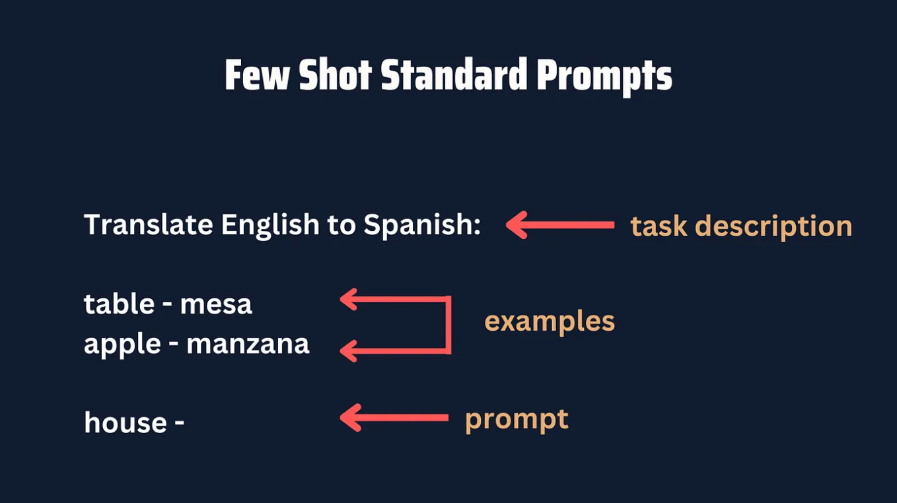
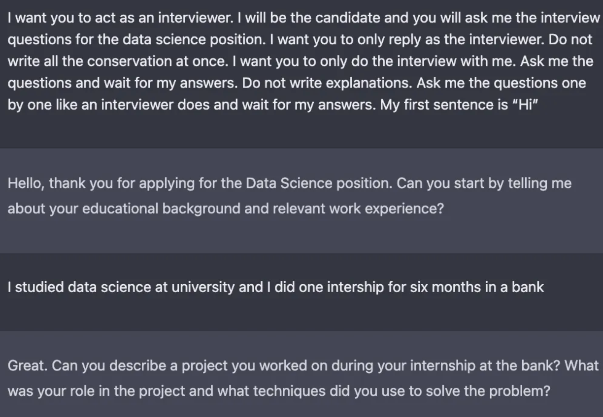
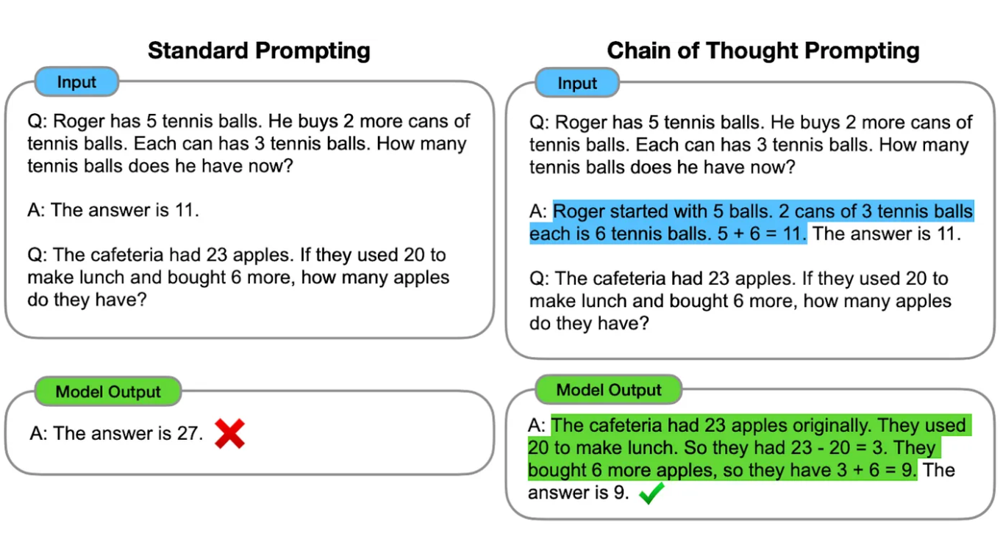

# 你正在错误使用ChatGPT!怎么样使用能超过99%的ChatGPT使用者

[toc]

我们大多数人错误使用了ChatGPT。

---

在提示信息中，我们不使用例子。

我们忽略的信息是我们可以通过角色（扮演）控制ChatGPT的行为。

我们让ChatGPT猜测（提供）材料，而不是提供给它一些信息。

这些情况发生是因为我们大多数是使用标准的提示，这些标准的提示能帮助我们一下就能完成工作，但是（标准提示）不总是有效。

我们需要学习创建高质量的提示词来获得更好的结果，我们需要学习提示工程！并且，在这个专栏中，我们将学习在提示工程中已经被使用的4个技巧。

## 一些镜头标准提示

一些镜头标准提示是我们之前见过的标准提示，但是这里（标准提示）会带有任务的事例。

为什么有例子了？是这样的，如果我们想增加获得我们想要标准结果的几率，你必须增加任务事例，事例里面的提示工程会尝试解决这个问题。

一些镜头标准提示有一个任务描述，事例和提示组成。在这个案例中，使用一个例子的提示开头，使用模型补全缺失的单词。

下面是一些组成标准提示的各个部分。

现在，我们来创建另外的提示，例如，我们想从文本“I want to fly from Orlando to Boston”中提取机场的编码。

下面是我们最可能使用的标准词。

>Extract the airport codes from this text: “I want to fly from Orlando to Boston“

这个任务完成之后，但是有时候结果是不足够的。在这个案例中，你必须有一些标准镜头提示语。

>Extract the airport codes from this text:
>
>Text: “I want to fly from Los Angeles to Miami.”
>Airport codes: LAX, MIA
>
>Text: “I want to fly from Nashville to Kansas City.”
>Airport codes: BNA, MCI
>
>Text: “I want to fly from Orlando to Boston”
>Airport codes:

如果我们在ChatGPT上尝试上面的提示，我们将得到特定格式（我们在例子中指定）的机场编码。

强调下，之前的研究表明，在例子中实际答案不是重要的，但是答案的标签库是重要的。标签库是被给任务所有的标签的集合。你甚至通过使用标签库中的随机标签改善提示的结果。

让我们在我们的例子中通过输入随机的机场编码测试下这个结论。

>Extract the airport codes from this text:
>
>Text: “I want to fly from Los Angeles to Miami.”
>Airport codes: DEN, OAK
>
>Text: “I want to fly from Nashville to Kansas City.”
>Airport codes: DAL, IDA
>
>Text: “I want to fly from Orlando to Boston”
>Airport codes:

如果你在ChatGPT上尝试上面的提示，你仍然将得到正确的机场编码MCO 和BOS。

无论你的事例是否是正确的，是否包含标签库中的随机标签。这都将会帮你改善结果并且模型将会格式化你的提示答案。

## 角色提示

有时，ChatGPT的默认行为不足以满足你想要。这个时候你需要为ChatGPT设置一个角色。

例如你想要为一个工作面试做一个练习。通过告诉ChatGPT“act as hiring manager”并且增加更多提示的细节。你将为任何职位模拟一个工作面试。

正如你看到这样，ChatGPT表现的就像因为这个职位在面试我。

就像这样，你可以让ChatGPT扮演一个语言导师来练习外语，例如西班牙语，或者扮演一个影评家来分析你喜欢的电影。在[这个链接文章中](https://artificialcorner.com/how-to-use-chatgpt-to-learn-a-language-and-practice-it-f7e7e38b1cee)，我更深入研究了如何将ChatGPT变成你的语言导师或者语言伙伴。

你只要开始你的提示，例如“act as a...” 并且尽可能加入一些细节。如果你需要一些灵感，看一下这个你寻找[提示的仓库](https://prompts.chat/)来使你的ChatGPT表现的像一个专业的演员，医生，或者其他职业...。

## 给提示词增加个性并且生成知识

当为邮件，博客，故事，文章等等生成文本时，以下两个提示方法是很有用的。

首先，“adding personality to our prompts”，我的意思是添加一种风格和描述符。添加风格可以帮助我们的文本获得一种特殊的语调，礼节，写作的范围或者更多其他的东西。

>Write [topic] in the style of an expert in [field] with 10+ years of experience.

为了定制输出，更进一步我们可以增添描述符。一个描述符仅仅是一个形容词，你可以添加它来调整你的提示。

例如：你想写一篇关于AI将如何取代人类的500字的blog。如果你想创建一个标准的提示，“write a 500-blog post on how AI will replace humans”，你可能会得到一个普通的文本。

然而，如果你增加一些形容的词语，例如鼓舞人心的，讽刺意味的，有趣的，娱乐性强的，输出将有明显的改变。

让我们给我们先前的提示增加描述符。

>Write a **witty** 500-blog post on why AI will not replace humans. Write in the style of an expert in artificial intelligence with 10+ years of experience. Explain using **funny** examples

在我们的例子中，AI专家的风格和例如“有趣”，“机智”增添了不同的语调，为ChatGPT生成的文本。副作用是我们的文本将很难被AI detectors发现。

最终，我们可以使用生成知识方法来改善博客。这包含在生成最终响应之前，生成一些潜在关于某个主题的有用信息。

举个例子，在用先前提示生成文本之前，我们可以先生成知识,然后写邮件文本

>*Generate 5 facts about “AI will not replace humans“*

一旦我们有了5个因素，我们可以将这些信息给到其他的提示，以此来写出更好的邮件文案。

>**# Fact 1
>\# Fact 2
>\# Fact 3
>\# Fact 4
>\# Fact 5**
>
>**Use the above facts to** write a witty 500-blog post on why AI will not replace humans. Write in the style of an expert in artificial intelligence with 10+ years of experience. Explain using funny examples

为了以防你对其他改善你使用ChatGPT写邮件有兴趣，你可以[链接到这个指导](https://artificialcorner.com/5-minutes-to-forever-improve-your-blog-posts-with-chatgpt-and-other-ai-tools-a80e63c1dc37)

## 思考提示的链条

不像标准的提示，在思考提示的链条中，模型会诱发产生中间推理的步骤在产生被给出的最终答案之前。换句话说，模型将解释它的原因而不是直接给出问题的答案。

为什么原因是重要的？原因的解释通常会引导出更多精确的结果。

为了使用思维提示的链条，我们必须提供一些镜头例子，在这些例子中原因被相同的方式被解释。用这种方法，当回答提示时，解释性过程将被呈现出来。

下面是标准提示与思考提示链条的比较。

跟我们看到的一样，在思维提示的链路中，诱导模型解释解数学问题的过程原因这样的实际做法，会引导更精确的结果。

需要强调的是思考提示的链条在算术，常识，符号论证的问题中，对于改善结果是有效的。

**更新**：在这片文章发布后，GPT-4才发布。GPT-4比之前的版本表现更优秀在论证能力上，因此，你可能不需要在GPT-4上使用思考提示链条。我鼓励你自己测试下，这是是使用[new GPT-4的四种方式](https://artificialcorner.com/4-ways-to-access-the-new-gpt-4-2-free-options-69eff2558045)。

如果你想学习更多关于提示工程学，这里有[4个提示的工程课程](https://artificialcorner.com/4-free-prompt-engineering-courses-to-join-the-top-1-of-chatgpt-users-bceca39f17e4])，你可以跻身前1%的ChatGPT使用者，并且有一些Midjourney 提示工程技巧来帮助创建更好的图片。

---

原文出处：

[You’re Using ChatGPT Wrong! Here’s How to Be Ahead of 99% of ChatGPT Users](https://artificialcorner.com/youre-using-chatgpt-wrong-here-s-how-to-be-ahead-of-99-of-chatgpt-users-886a50dabc54)