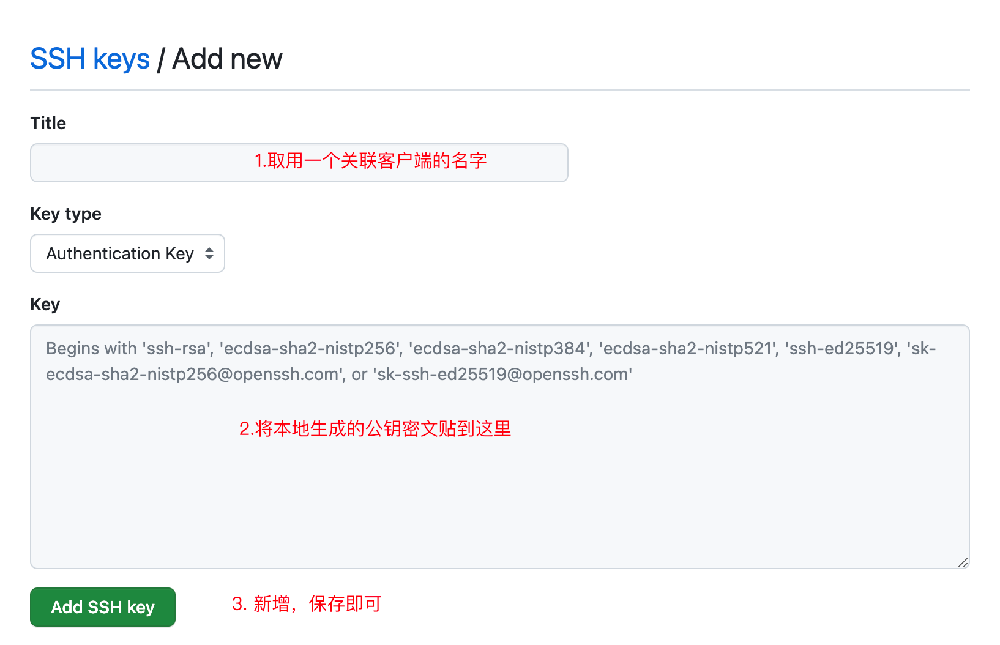
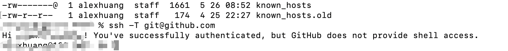

# mac电脑配置

[toc]

## 配置ssh连接 GitHub.com 

在配置clone，push注意配置的远程仓库是SSH URL还是HTTPS URL,注意区分  [About remote repositories](https://docs.github.com/en/get-started/getting-started-with-git/about-remote-repositories#about-remote-repositories)

* An HTTPS URL like `https://github.com/user/repo.git`
* An SSH URL, like `git@github.com:user/repo.git`

否则，在git  push  origin master 就会报错：如下

###  1、checking-for-existing-ssh-keys

https://docs.github.com/en/authentication/connecting-to-github-with-ssh/checking-for-existing-ssh-keys

### 2、Generate new ssh key

https://docs.github.com/en/authentication/connecting-to-github-with-ssh/generating-a-new-ssh-key-and-adding-it-to-the-ssh-agent

### 3、add ssh key to the ssh-agent

https://docs.github.com/en/authentication/connecting-to-github-with-ssh/generating-a-new-ssh-key-and-adding-it-to-the-ssh-agent#adding-your-ssh-key-to-the-ssh-agent

* 配置~/.ssh/config
* `ssh-add  `  private key to the ssh-agent 

### 4、Add the SSH public key to your account on GitHub

将公钥匙密文copy到github官方网站

settings -> Access -> SSH and GPG keys -> SSH keys;

### 5、Test your SSH connection

https://docs.github.com/en/authentication/connecting-to-github-with-ssh/testing-your-ssh-connection

