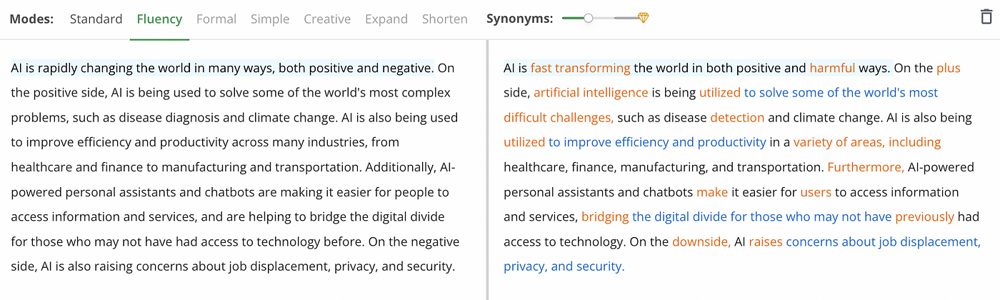

# 能让你生活更容易的6个AI组件(除了ChatGPT)

[toc]

在尝试使用ChatGPT几周之后，我很好奇想知道其他的AI工具是怎么样帮助我们生活的更加容易。

AI正在改变我们的工作方式并且我不想错过机会来尽可能使用它，因此，我尝试了许多AI工具来节省时间并提高在工作中的生产力。

有些事有帮助的，而其他则没有帮助。这里有6个AI工具来帮助我们使我们的生活更加容易。

## 1、Tom：AI驱动的演示构建者

你曾经必须需要进行一场演示，但是，你不能够提出一个好的大纲或者不知道写点什么并且不知道包含什么图片？

这种情况发生在身边很多次当在用ppt做展示的时候。幸运的是，因为像Tome样的AI工具，这种已经成为一个过去的问题。

Tom是演示文稿方面的ChatGPT。

你只要需要键入一个提示，按下enter，并且等待不到几分钟，Tome将生成包含令人信服的文本和漂亮耐看图片的演示。

这是一个例子。

> Source: https://beta.tome.app/

除了AI能力，Tom还有许多功能来创建一个演示。举个例子，你可以拖拽并且丢入一个东西，添加3d渲染图，裁剪一个录像，从web中嵌入一个生动的内容，等等。

## 2、QuillBot：一个AI工具可以增强你的写作能力

QuillBot是一个工具能够工作的像一个译者，语法检查者，抄袭检查者，总结者，引文生成者。

释义者大概是最好的功能（QuillBot已经拥有的），你只要复制并且粘贴你的文本，并且决定你想要的词汇的变化。

你可以使用QuillBot来提高由ChatGPT生成的机器文本。举个例子，我要ChatGPT写一段关于AI正怎样改变世界的文字，然后复制黏贴到QuillBot。

这是结果。

你可以点击任意一个单词来查看一个建议的同义词列表并且手动选中最适合你语句的一个。

如果当写作时你最主要的挣扎是你有限的词汇量（像我），很显然你发现这个工具是非常有用的，当写邮件、文章和博客。

## 3、Descript：更容易的视频与音频的编辑

如果你经常编辑视频或者音频记录，你知道剪掉不想要镜头的位置是多么费时。有时候 我们甚至需要重新记录，如果我们忽略一个单词或者没有说出我们想表达的意思。

Descript精简所有的这些问题。

Descript是一个音频/视频编辑器，它可以像一个文档一样工作。它有很多AI工具，这些工具只需要点一下能快速删除在我们记录的填充词（语气词）比如“um”,"uh"并且将糟糕的记录转成有质量的专业品。

那就是说，大概它最有用的功能就是配音，配音能够纠正你的记录就像打字一样简单。

它是怎么工作的？它创建了一个你声音逼真的克隆体，因此你可以“记录新的单词”就像简单的输入文字。为了完成这个，你需要使用你一些时间的声音来训练这个工具。

这是一个例子。

> Source: https://youtu.be/EAowXV_hWks

它是不是很酷？

你花费时间的声音训练这个工具越多，它将产生的结果就更好。

## 4、BHuman：上规模的AI驱动的个性化视频

在生意中、与客户建立人性化的联系是重要的。正因为这个原因，一些公司在给你发送的邮件中用你的名字称呼你。

为你每一个客户定制邮件是容易的，但是对于视频，我们不能这么说。幸运的是，现在AI视频可以像那样帮助你。你只需要录制一个短小的视频模版，关联上你的数据（一个姓名的列表等等）并且然后克隆你自己的视频生成数以千计的个性化视频。

这是一个使用BHuman怎么完成这件事的例子。

>Source: https://www.bhuman.ai/

在这个视频模版中，有两个占位符号 “name”和“product”。

一旦数据被关联，生成的视频将提及每个客户端数据对应的名字与产品。

这就是你成千上百的个性化视频是怎么生成的。

## 5、Cleanup Pictures

到目前为止，从相片中清理不想要的物体利用像Photoshop这样的工具是可能的，但是Cleanup Pictures将这带入到更高级的阶段应为它的AI。

你仅仅必须上传一张图片并且使用刷子来摆脱任何你不想要的物体。

>Before/After (Source: Source: https://cleanup.pictures/)

因为AI,你用Cleanup Pictures得到的最终结果看起来比Photoshop更加的自然，为什么会这样？在Photoshop上被使用的克隆邮戳工具需要一个背景参考，但是AI驱动的Cleanup Pictures只需要少量的点击操作就能够猜测到后面的，不想要的文本，任务或者物体。

## 6、Notion AI: 写作更快并且增加你的创造力

Notion AI 将做笔记的app推向一个新的台阶。它能够通过Nation app在几秒钟内为你的博客，邮件，社交博客生成文本。

使用Notion AI ，你可以省出很多时间！这里展示了它是怎么工作的。

>Source: https://www.notion.so/product/ai

但是，那不是全部。除了生成文本，Notion AI也是一个强大的编辑器。他可以帮助你总结本本，纠正拼写与语法，翻译你的文本成多种语言。

---

原文出处：

[6 AI Tools That Will Make Your Life Easier (Other Than ChatGPT)](https://artificialcorner.com/6-ai-tools-that-will-make-your-life-easier-a1b71d15cbff)