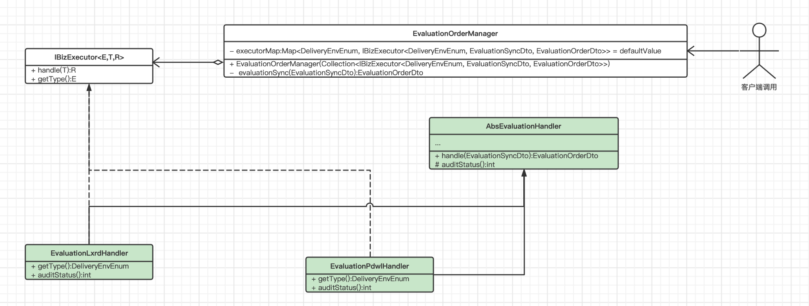
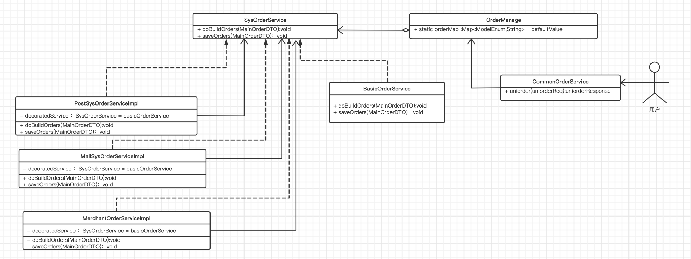

# 业务代码中常用的两种设计模式

[toc]

设计模式按照大类分总体分为三种

* 创建型
* 结构型
* 行为型

以下是项目中常用的两种设计模式：**策略模式**与**装饰器模式**，来辨析这两种设计思路组织代码的方式；

其中在实践中策略模式，使用了**继承**关系来抽取公共业务代码，是一种自下而上的**重构逻辑**；

在装饰器模式中，使用了**组合**关系来抽取业务代码做为接口的基本实现，体现在拓展的灵活性。

##策略模式

被划分到**结构型设计模式**的大类中；结构型设计模式更加关注于，**通过类或者对象的组合来完成业务，所以单功能个接口的实现类中独立型很强**

### 目的

定义好算法家族，并封装好其中一个，使他们可以相互替换。策略模式使**算法的变化独立**与他们使用它的客户。

### 编程实例

数据同步到我的服务，不同环境同步过来的数据，我会做不同数据加工方式，现在有lxrd与pdwl两种不同的环境，分别对应不同的数据加工方式。

1. 不同的环境对应着不同的执行策略，策略的顶层接口：`IBizExecutor<E,T,R>`

   >\+ handle(T):R
   >\+ getType():E  这是获取策略的环境标识，当满足这个环境时，就会执行这个相应的handler

2. 具体的执行策略是`EvaluationLxrdHandler`,`EvaluationPdwlHandler`
3. 策略实现中有公用的逻辑，可以通过**继承关系**抽象到父类中：`AbsEvaluationHandler`

## 装饰者模式

被划分为**行为型设计模式**；该模式关注在对象之间，怎么去通信，怎么去做指责划分来完成业务。

### 目的

将这种**变化封装**，实现动态的为对象附加额外的指责。装饰器为真正的实现子类提供灵活的替代方案，以扩展功能。如果这里采用策略模式，利用子类去独立实现，则子类数量会发生爆炸。

### 编程实例

1. 订单中心下单过程，会创建订单与保存订单，抽象一个接口`SysOrderService`

   >\+ doBuildOrders(MainOrderDTO):void 创建订单
   >
   >\+ saveOrders(MainOrderDTO)：void 将创建的订单保存

2. 首先有一个基础的下订单的功能，`BasicOrderService`,完成对订单下单操作的基操

3. 然后根据订单类型，可以转成不同的付款商户，`MerchantOrderServiceImpl`,对订单做修改

4. 不同的对接方，他们的对订单的诉求不一样，封装在各自对应的模块中`PostSysOrderServiceImpl`,`MallSysOrderServiceImpl`

## 参考

[Strategy](https://java-design-patterns.com/zh/patterns/strategy/)

[Decorator](https://java-design-patterns.com/zh/patterns/decorator/)

[设计模式](https://blog.csdn.net/m0_37741420/article/details/106169752)

